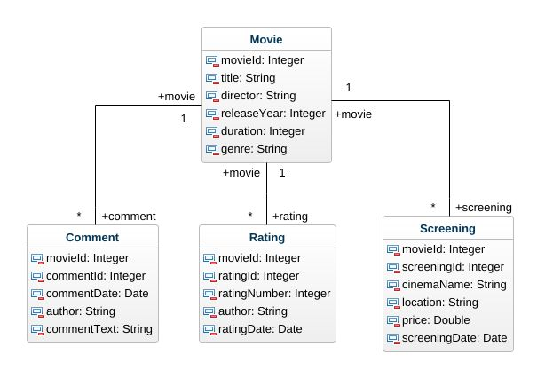
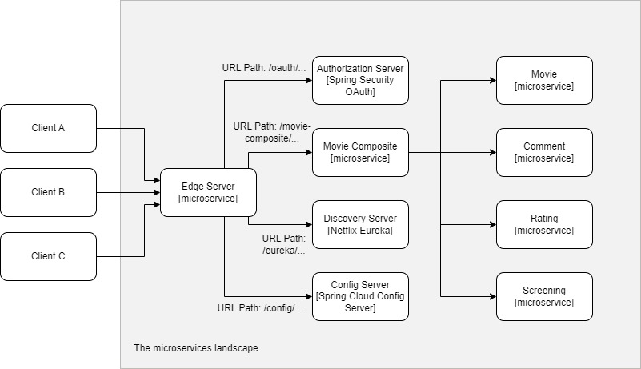

# MOVIE-INFO-MICROSERVICES

MovieInfo microservices is a movie information service. It is a microservice architecture, implemented using **Spring Boot** and **Spring Cloud**. Business logic is presented through five microservices: movie, rating, comment, screening and movie-composite. The first four represent core microservices and movie-composite represents integration of the core ones.
## Exam assignment
The microservice system responds to the defined project task.

A microservice system should:
- be developed using Spring Cloud and contain all the microservice components necessary for the functioning of such a system in production,
- each system component is containerized (microservice, database, etc.),
- contains at least 5 microservices related to the application's business logic,
- to support different communications (synchronous/asynchronous) according to business logic,
- includes unit and integration tests and
- the pipeline (build/test/deploy) is clearly defined and configured.

## Persistence
Persisting data in various types of databases is enabled using **Spring Data**. In this project Spring Data is used for one type of NoSQL database - **MongoDB**, and for one type of traditional relational database - **MySQL**. Two core concepts in Spring Data are entities and repositories, and they generalize how data is stored and accessed from various types od database. Each microservice has its own database:
- Movie - MongoDB
- Comment - MongoDB
- Rating - MongoDB
- Screening – MySQL

Java mapper tool, MapStruct, is also used to transform between Spring Data entity objects and the model API classes. The entity classes are similar to the API model classes in a term of what fields they contain.
The image below shows the class diagram used in the project.



## Reactive microservices
The logic for retrieving data (GET request) for the movie composite microservice is a **non-blocking synchronous** call to all four core microservices since there is an end user waiting for response. APIs in the core services are non-blocking as well. To make services reactive, programming model **Project Reactor** is used. The core data types in Project Reactor are Mono object (process 0..1 element) and Flux (process a stream of 0..N elements). The MongoDB-based services is made reactive, amongst others, using ReactiveCrudRepository interface. In the case of services which uses JPA to access its data in a relational database, there is no support for non-blocking programming model, so we run blocking code using Scheduler.

In contrast to the approach used for the retrieving of data, for creating and deleting, an event-driven asynchronous approach is used. The composite service will publish create and delete events on each core service topic and return 200 OK without waiting the core services to process their message. To implement an event-driven asynchronous services, Spring Cloud Stream is used. To able composite service to publish events on different topic, one MessageChannel per topic in the MessageSource interface is declared. Injected MessageSource object is used to publish event on a topic using the method to get a message channel and then send() method. MessageBuilder is used to create a message. To be able to consume events in core services, MessageProcessor that listen for event is declared. MessageProcessor for MongoDB-based services is based on blocking programming model. Messaging systems that have been used in this project are **RabbitMQ** and **Apache Kafka**.

## Microservice landscape
Microservice landscape is attached in the following image.



**SpringCloud** is used to make services production-ready, scalable, robust, configurable, secure and resilient. SpingCloud is used to implement the following design pattern:
- **Service Discovery using Netflix Eureka** – Service Discovery keeps track of currently available microservices and the IP addressess of its instances.
- **Edge server using Spring Cloud Gateway** – The gateway provides entry point to the microservice landscape, and it is used for routing to APIs. Some of the microservices are exposed to the outside of the system landscape (discovery and composite services) and remaining of them (core services) is hidden from external access. The exposed microservices must be protected against requests from malicious clients.
- **Reactive microservices** that are previously described.
- **Central configuration using Spring Cloud Configuration Server** – Central configuration is used to centralize managing the configuration of microservices. Configuration files for microservices are placed in a central configuration repository in the local memory.
- **Security access to APIs using OAuth 2.0**


## Pipeline (build/test)
```bash
./gradlew build && docker-compose build && docker-compose up
```
After running command mentioned above, you can run bash ```./test-all.bash``` command in order to test endpoints and general functionality of the system.<br /> Alternatively, you can execute bash script using following command bash ```./test-all.bash start stop``` which starts the system, and eventually stops it, once all tests are executed. For stopping the system at any time, you can use following command ```docker-compose down```.
